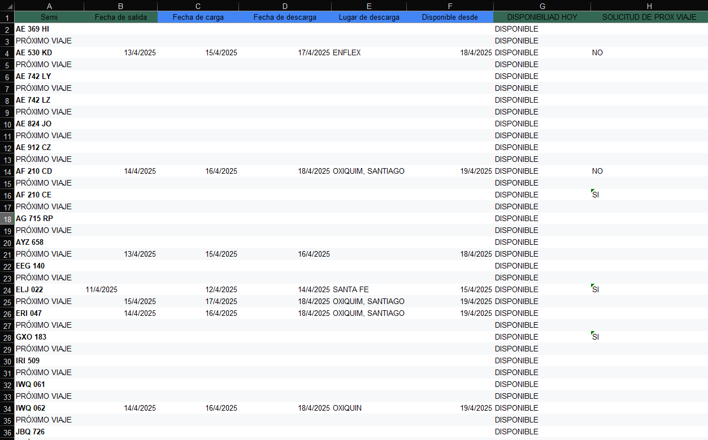
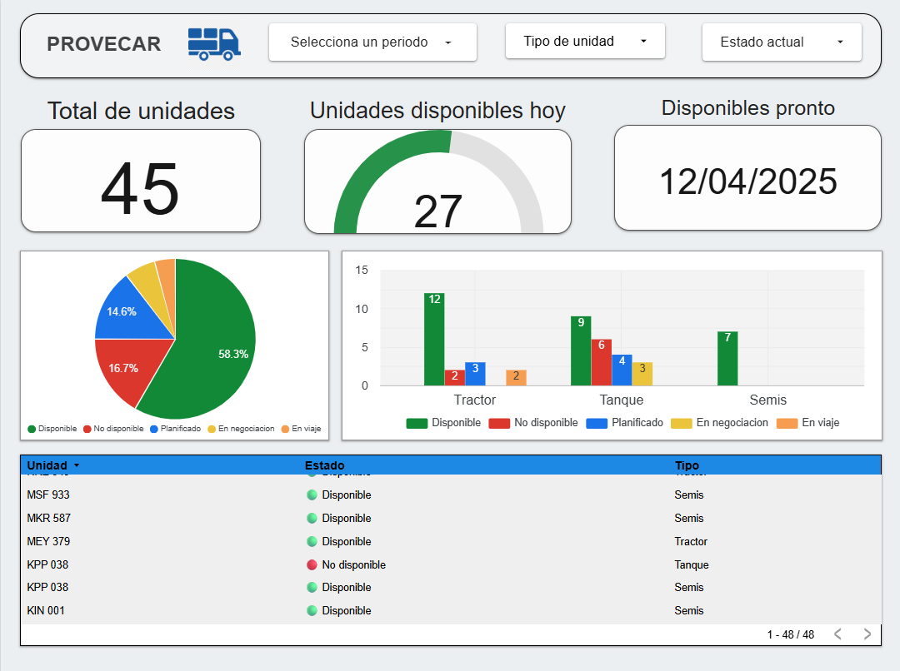

# 🚛 Dashboard de Disponibilidad Logística – Caso Real

Este proyecto surge a partir de un problema concreto en una **empresa de logística**, que necesitaba saber qué unidades estaban disponibles, en planificación o en viaje. Recibimos una planilla caótica, sin validaciones, con datos duplicados y sin estructura.

---

## 🎯 Objetivo

Transformar una planilla desordenada en un sistema automatizado, claro y visual para toma de decisiones en tiempo real.

---

## 🧩 Solución aplicada

✔️ Limpieza y unificación de datos en Google Sheets  
✔️ Creación de columna `Estado` con lógica condicional  
✔️ Validaciones y listas desplegables para evitar errores humanos  
✔️ Formato condicional para mejorar la lectura rápida  
✔️ Dashboard dinámico en **Looker Studio** conectado a la planilla

---

## 🔍 Mejora de experiencia en Google Sheets

Además de ordenar los datos, incorporamos **filtros visuales tipo segmentador** directamente en la planilla para facilitar la navegación:

- Filtro por **Tipo** de unidad (Tractor, Tanque, Semis)  
- Filtro por **Estado actual** (Disponible, En viaje, No disponible...)  
- Filtro por **Conductor** asignado

---

## 📊 Resultado visual

| Antes | Después |
|-------|---------|
|  |  |

---

## 🛠 Herramientas utilizadas

- **Google Sheets** (estructura, fórmulas, validación, filtros)
- **Looker Studio** (visualización y KPIs)
- **GitHub** (documentación profesional)

---

## 💡 Qué vas a encontrar en este repositorio

- El archivo final (`disponibilidad_logistica.xlsx`) estructurado y listo para BI  
- Capturas del antes y después  
- Explicación paso a paso en `proceso.md`  
- Modelo de transformación de datos sin código (Google Sheets + Looker)

---

## 📫 Sobre mí

Este proyecto fue realizado por **Juan Diego** desde [@data.snake](https://www.instagram.com/data.snake), donde ayudo a empresas a transformar caos en claridad con análisis de datos y visualización.

📧 Contacto: data.snake12@gmail.com  
🌐 Web: [datasnake.tech](https://datasnake.tech)

---
